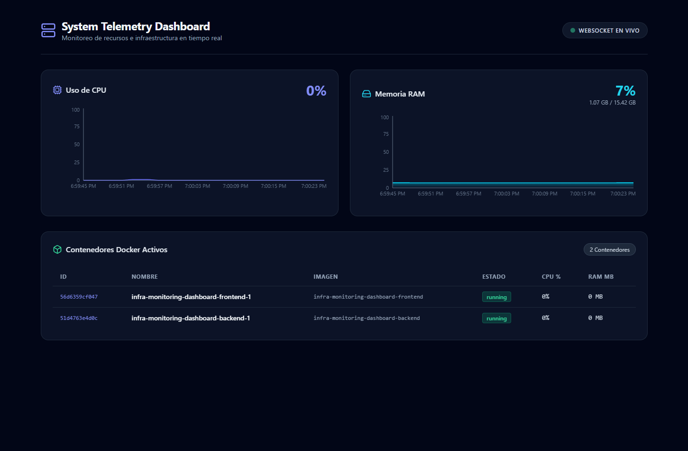

# 📊 Real-Time Infrastructure Telemetry Dashboard

A lightweight, real-time telemetry and infrastructure monitoring system built with WebSockets. Streams live host server metrics—such as CPU utilization, RAM consumption, and active Docker container states—directly to a responsive dark-mode dashboard.

<p align="center">
  
</p>

---

## ⚡ Key Features

* **Real-Time Telemetry Streaming:** Instant, low-latency metric pushes via WebSockets (`Socket.IO`) without polling overhead.
* **Live Hardware Metrics:** Visual representation of CPU load and system memory usage with historic time-series graphs.
* **Docker Engine Integration:** Direct read-access to the Docker daemon socket (`/var/run/docker.sock`) to list running containers, CPU %, and memory usage.
* **Modern Dark UI:** Responsive dashboard UI built using React, Tailwind CSS, and Recharts.

---

## 🛠️ Tech Stack

* **Backend:** Node.js, Express, Socket.IO, `systeminformation`.
* **Frontend:** React, TypeScript, Recharts, Lucide Icons, Tailwind CSS, Vite.
* **Infrastructure & Containerization:** Docker, Docker Compose, Docker Socket Integration.

---

## 🚀 Quick Start with Docker Compose

The complete stack (Backend Telemetry Collector + Frontend Dashboard) can be launched using a single Docker Compose command on any operating system (Linux, macOS, Windows).

### Prerequisites
* [Docker](https://docs.docker.com/get-docker/) & [Docker Compose](https://docs.docker.com/compose/install/) installed and running (via Docker Engine, Docker Desktop, or any equivalent container runtime).

### Deployment:
```bash
# 1. Clone the repository
git clone [https://github.com/SnakeJuice/infra-monitoring-dashboard.git](https://github.com/SnakeJuice/infra-monitoring-dashboard.git)
cd infra-monitoring-dashboard

# 2. Launch the dashboard stack
docker compose up --build
```

### Exposed Services:
* 🎨 **Dashboard Web UI:** [http://localhost:3000](http://localhost:3000)
* ⚡ **Telemetry API Server:** [http://localhost:4000](http://localhost:4000)

> **Note for Docker users:** On Linux systems, make sure your user has permissions to access `/var/run/docker.sock` if you run into container socket access issues.

---

## 💻 Local Development

To run and modify the project locally with hot reloading enabled:

1. **Start the Backend Collector Server:**
   ```bash
   cd server
   npm install
   npm run dev      # Server starts on http://localhost:4000
   ```

2. **Start the Frontend Application:**
   ```bash
   cd client
   npm install
   npm run dev      # Vite dev server starts on http://localhost:5173
   ```

---

## 📌 WebSockets Events API

| Event Name | Direction | Payload |
| :--- | :--- | :--- |
| `telemetry:update` | Server ➔ Client | `{ cpu: number, ram: { used, total }, containers: [...] }` |

---

## 📝 License

Distributed under the MIT License.